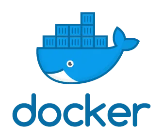
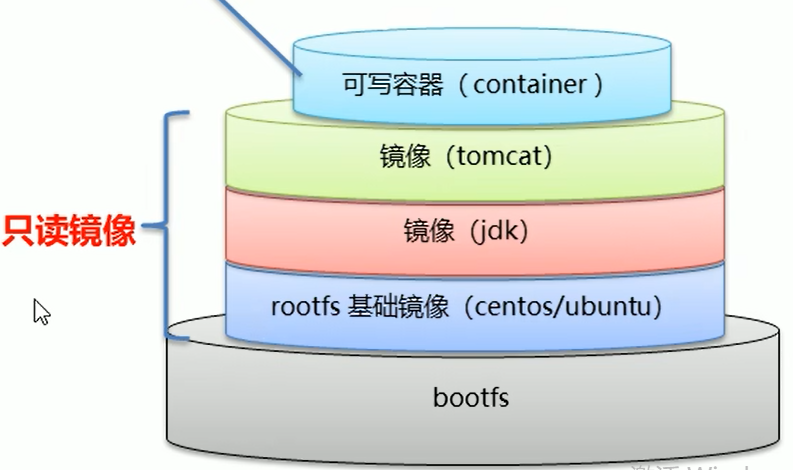

# docker
[Docker Doc](https://docs.docker.com/)
[Docker Hub](https://hub.docker.com/)
[视频](https://www.bilibili.com/video/BV1CJ411T7BK?p=2&vd_source=327b91fe5f132d5f43cffb262b7cc19d)


::: tip 
docker 是一种容器技术，解决软件环境迁移问题，沙箱机制，开销低
- 安装 yum install docker-ce
- docker 所在安装目录/var/lib/docker
- 卸载docker
1. service docker stop
2. apt-get remove docker
3. rm -rf /var/lib/docker/*
- 容器是镜像的运行实例，镜像只读
:::

::: tip 
- 阿里云镜像加速配置[Link](https://cr.console.aliyun.com/cn-hangzhou/instances/mirrors)
    - 个人加速器地址：https://gebghx7u.mirror.aliyuncs.com
    ```sh
    sudo mkdir -p /etc/docker
    sudo tee /etc/docker/daemon.json <<-'EOF'
    {
    "registry-mirrors": ["https://gebghx7u.mirror.aliyuncs.com"]
    }
    EOF
    sudo systemctl daemon-reload
    sudo systemctl restart docker
    ```  
:::

::: tip command
- image 导入导出
    - docker save imgID -o xxx.tar (多层layer打包)
    - docker load -i xxx.tar
- docker rm \`docker ps -aq\` 删除所有容器
- -d 后台守护运行
- volume 持久化存储数据
    - docker volume ls/prune 展示/删除不被使用的数据卷
    - 支持多个容器同时挂载 
- docker top containerID 容器进程
- docker stats containerID 容器资源
- docker log -f containerID 查看容器实时日志 

:::

::: tip dockerfile
- 镜像原理(文件系统叠加而成)
    - linux 文件系统由bootfs和rootfs组成
    - bootfs 包含bootloader引导加载程序和kerbel
    - rootfs: root文件系统/  /dev /proc /bin /etc
- 启动容器，会在最顶层加载一个读写文件系统

- docker commit containerID imdName:tag  生成新镜像
- 关键字
    - FROM 基于镜像
    - MAINTAINER 作者信息
    - RUN 执行命令 command / ['command', 'arg1', 'arg2']
    - CMD 容器启动时执行命令 command / ['command', 'arg1', 'arg2']
    - ENTRYPOINT 
    - COPY 复制文件
    - ADD 添加文件解压
    - ENV 环境变量
    - WORKDIR 工作目录
- 构建镜像：docker build -f dockerfile  -t imdName:tag . 
:::


