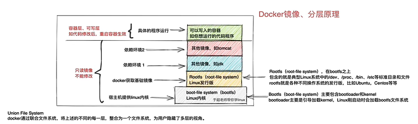

# docker
[Docker Doc](https://docs.docker.com/)
[Docker Hub](https://hub.docker.com/)
[视频](https://www.bilibili.com/video/BV1CJ411T7BK?p=2&vd_source=327b91fe5f132d5f43cffb262b7cc19d)


::: tip 
docker 是一种容器技术，解决软件环境迁移问题，沙箱机制，开销低
- linux 提供了chroot, namespace, Cgroup技术，改变根目录，命名空间中只能看到空间的进程，cgroup限制容器对资源的使用
- 安装 yum install docker-ce
- docker 所在安装目录/var/lib/docker
:::

::: tip 加速地址配置
- 阿里云镜像加速配置[Link](https://cr.console.aliyun.com/cn-hangzhou/instances/mirrors)
    - 个人加速器地址：https://gebghx7u.mirror.aliyuncs.com
    ```sh
    sudo mkdir -p /etc/docker
    sudo tee /etc/docker/daemon.json <<-'EOF'
    {
    "registry-mirrors": ["https://gebghx7u.mirror.aliyuncs.com"]
    }
    EOF
    sudo systemctl daemon-reload
    sudo systemctl restart docker
    ``` 
- docker pull 镜像代理指定 （/etc/default/docker add: export http_proxy=""）
- image 导入导出
    - docker save imgID -o xxx.tar (多层layer打包)
    - docker load -i xxx.tar
:::


::: tip dockerfile
- docker commit containerID imdName:tag  生成新镜像
- 镜像原理(文件系统叠加而成)
    - linux 文件系统由bootfs和rootfs组成
    - bootfs 包含bootloader引导加载程序和kerbel
    - rootfs: root文件系统/  /dev /proc /bin /etc
- 启动容器，会在最顶层加载一个读写文件系统b 

- 关键字
    - FROM 基于镜像
    - MAINTAINER 作者信息
    - RUN 执行命令 command / ['command', 'arg1', 'arg2']
    - CMD 容器启动时执行命令 command / ['command', 'arg1', 'arg2']
    - ENTRYPOINT 容器启动时执行的命令，CMD 会作为参数被接收
    - COPY 复制文件
    - ADD 添加文件并解压
    - ENV 环境变量，构建镜像和运行容器时都生效
    - ARG 只在构建时有效
    - VOLUME 容器运行时自动挂载为匿名卷
    - EXPOSE 对外提供的服务端口
    - WORKDIR 工作目录
- 构建镜像：docker build -f dockerfile  -t imdName:tag . 
:::

::: tip docker镜像原理

- 通过一个image启动容器时，docker会在最顶层添加一个读写文件系统作为容器
- docker 本质基于unionFS管理的分层文件系统
- 多层可以为多个image复用节省空间
- 镜像可以被多个容器共享
- 可读写容器层（copy-on-write)
    - 读取， docker 会从上往下镜像层中查找文件，找到复制到容器层
    - 修改也会读取到容器层进行修改，不会对源文件修改
    - 删除，只记录删除操作
:::


::: tip container
- 容器内的进程必须处于前台，否则容器之间退出
- --rm 容器退出时删除容器
- -d 后台守护运行
- -it 交互式运行容器
- volume 持久化存储数据
    - docker volume ls/prune 展示/删除不被使用的数据卷
    - 支持多个容器同时挂载 
    - -v host绝对路径（bind)、volume_name(不存在会自动创建/var/lib/docker/volumes):container_path:rw
- docker rm \`docker ps -aq\` 删除所有容器
- docker ps -qa | xargs docker rm 批量删除停止的容器
- docker top containerID 容器进程
- docker stats containerID 容器资源
- docker logs -f containerID 查看容器实时日志 
:::

::: tip docker-compose.yml
[docker compose file](./docker-compose.yml)
[compose所有参数解释](https://blog.csdn.net/yb546822612/article/details/105276164)
- docker-compose config -q 检验docker-compose.yml 是否有语法错误
- VOLUME 数据卷，持久化存储数据，容器与主机与容器之间的数据共享
- NETWORK （bridge/host/none) bridge虚拟网卡docker0，默认启动容器都会连接到该虚拟网桥
    
- 自定义网络（一般bridge) 容器间互联通信，容器IP变动时可以通过服务名直接网络通信               
:::

::: tip CIG
- CIG 分布式容器==监控==平台
- CAdvisor 分布式容器性能数据采集（CPU 网络IO 磁盘IO)
- InfulxDB 数据存储
- Granfana web数据展示
:::


----
docker 生命周期：
