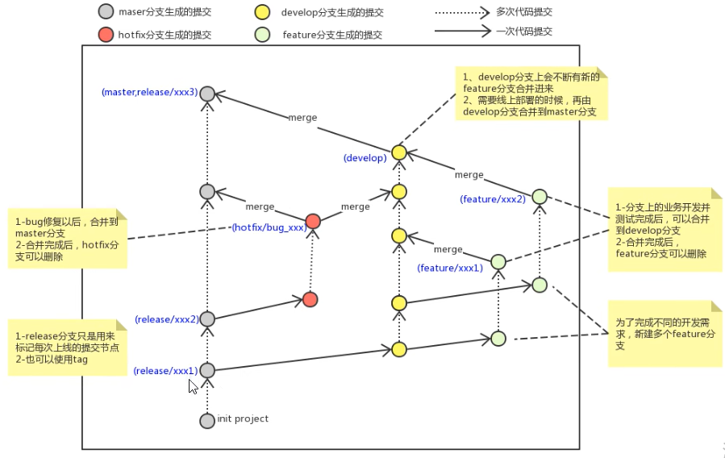
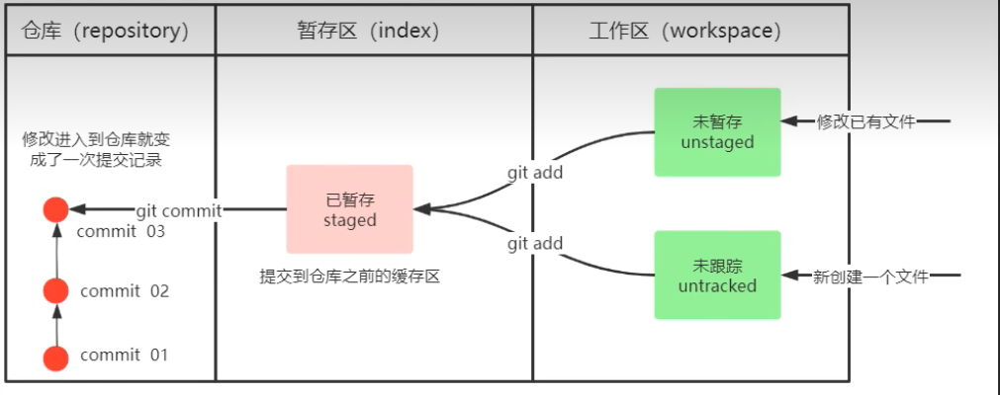
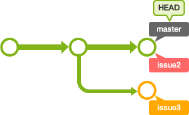
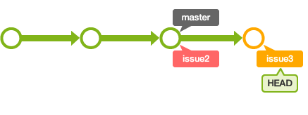

# git

[git脑图](https://naotu.baidu.com/file/a7dcc552a46c8912e20d991d1249ad85)
[视频](https://www.bilibili.com/video/BV1MU4y1Y7h5?p=11&vd_source=327b91fe5f132d5f43cffb262b7cc19d)

::: tip command
- git log 查看提交历史 ==alias git-log='git log --all --pretty=oneline --abbrev-commit --graph --color --decorate'==
- 版本切换：git reset --hard commitID
- git reflog 可以查看到删除掉的提交记录
- .gitignore (*.txt 指定不被git管理的文件)
- git branch -vv查看分支详细信息
- ==git checkout -b xxxbranch== 新建并切换到该分支
- git branch -d xxxbranch删除分支（-D强制删除）
- git merge dev 合并dev分支到当前分支
    - 解决冲突：确认冲突文件，手动确认修改，之后再git add . ---> git commit；
- 分支master 生产分支  develop 开发分支  feature/xxxx分支 hostfix/xxxx分支
:::

::: tip 更换远程仓库
- git remote -v :查看远程仓库信息
- git remote remove origin :删除远程仓库信息
- git clone -b dev xxx.git :直接克隆远程仓库👻==推荐直接clone==
    - git push origin HEAD:dev (推送当前分支到远程dev分支，远程dev不存在会创建)
    - git branch --set-upstream-to=origin/main  dev 关联当前分支到远程分支,devtrack remote branch
-----
- git remote add  origin  url
    - url : git@url.git  / https://url.git
    - git pull origin master --allow-unrelated-histories(本地仓库有文件，远程仓库也有文件)   
    - git branch --set-upstream-to=origin/main  dev
    - git push origin HEAD:dev (推送当前分支到远程dev分支，远程dev不存在会创建) 
:::

::: tip 补充
- 设置git提交代码时的用户信息
git config --global user.name "Your Name"
git config --global user.email "email@example.com"
git config --global -l 显示全局配置
-  master分支应该是非常稳定的，也就是仅用来发布新版本，平时不能在上面干活；
- 干活都在dev分支上，也就是说，dev分支是不稳定的，到某个时候，比如1.0版本发布时，再把dev分支合并到master上，在master分支发布1.0版本；
- 合并分支时，==加上--no-ff参数就可以用普通模式合并，合并后的历史有分支，能看出来曾经做过合并==，而fast forward合并就看不出来曾经做过合并。

:::

::: tip 
Git rebase 合并分支
 
- git checkout issue3 
- git rebase master --> 解决冲突
- git add .
- git rebase --continue 进行提交

:::

