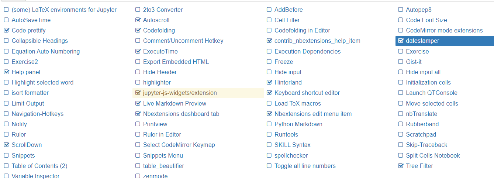

# instruction

[脑图](https://naotu.baidu.com/file/36d2a88fa73b3ab6e6508a28830dde55)

::: tip jypyter
- nohup jupyter notebook --ip 0.0.0.0 >jupyter.log 2>&1 &
- wsl中加入： --no-browser,不自动打开浏览器
- --notebook-dir="$jy_work" 指定启动时工作目录
- bashrc中加入自动开启jupyter service
    ```bash
    jy_work="/home/snail/jupyter_files"
    # check juputer progress and make it up
    jy=`ps -ef | grep jupyter | grep -v grep | awk '{print $2}'`
    if [ -z "$jy" ]
    then
            echo "Start Up jupyter ..."
            nohup jupyter notebook --ip 0.0.0.0 --notebook-dir="$jy_work" --no-browser  > ${jy_work}/jupyter.log  2>&1 &
    fi
    ```
-  安装jupyter插件
    ```bash
    pip install jupyter_contrib_nbextensions
    jupyter contrib nbextension install --user
    ```
常用插件 

:::

::: tip 操作
- tab 缩进或代码补全
- ctrl + enter 执行单元格
- 123456 对应多级标题
- b 下方插入单元格
- m 转换单元格为markdown
- y 转换单元格为code
- r 转换为raw状态
- dd 删除单元格
- ctrl+z 恢复最后删除的单元格
:::

